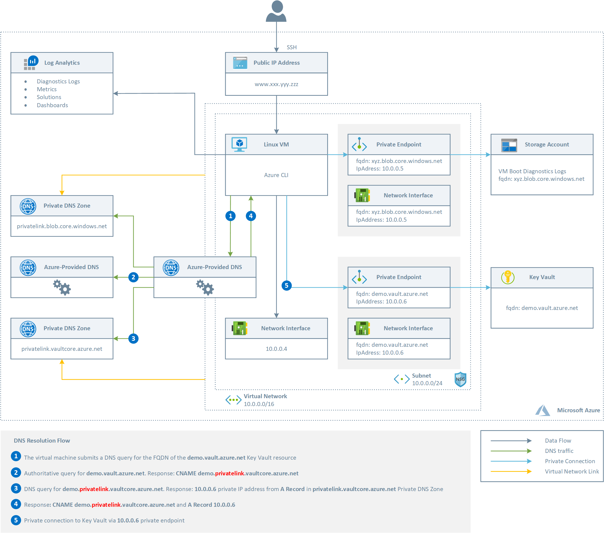
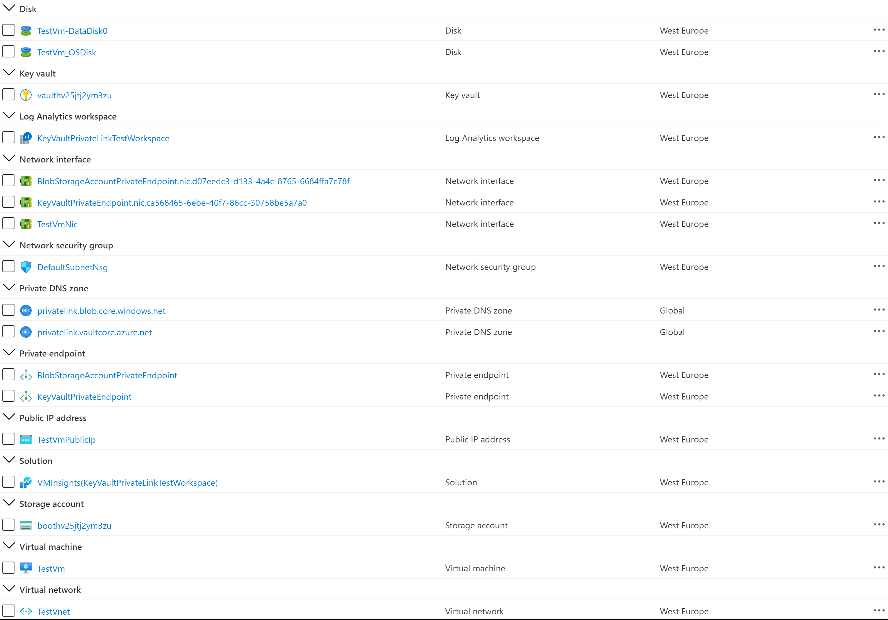
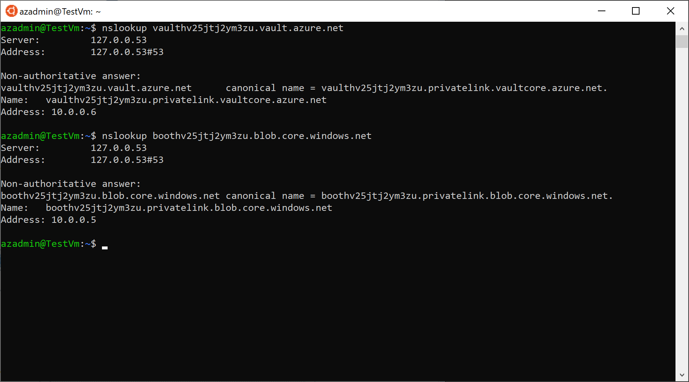

# Connect to Key Vault using an Azure Private Endpoint #

This sample demonstrates how to create a Linux Virtual Machine in a virtual network that privately accesses a Key Vault and an ADLS Gen 2 blob storage account using two [Azure Private Endpoints](https://docs.microsoft.com/en-us/azure/private-link/private-endpoint-overview). Azure Private Endpoint is a network interface that connects you privately and securely to a service powered by Azure Private Link. Private Endpoint uses a private IP address from your virtual network, effectively bringing the service into your virtual network. The service could be an Azure service such as Azure Storage, Azure Cosmos DB, SQL, etc. or your own Private Link Service. For more information, see [What is Azure Private Link?](https://docs.microsoft.com/en-us/azure/private-link/private-link-overview). For more information on the DNS configuration of a private endpoint, see [Azure Private Endpoint DNS configuration](https://docs.microsoft.com/en-us/azure/private-link/private-endpoint-dns).

## Architecture ##

The following picture shows the architecture and network topology of the sample.



The ARM template deploys the following resources:

- Virtual Network: this virtual network has a single subnet that hosts an Linux (Ubuntu) virtual machine
- Network Security Group: this resource contains an inbound rule to allow the access to the virtual machine on port 22 (SSH)
- The virtual machine is created with a managed identity which is assigned the contributor role at the resource group scope level
- A Public IP for the Linux virtual machine
- The NIC used by the Linux virtual machine that makes use of the Public IP
- A Linux virtual machine used for testing the connectivity to the storage account via a private endpoint
- A Log Analytics workspace used to monitor the health status of the Linux virtual machine
- A Key Vault with 3 sample secrets
- A blob storage account used to store the boot diagnostics logs of the virtual machine as blobs
- A Private DNS Zone for Key Vault private endpoints
- A Private DNS Zone for blob storage account private endpoints
- A Private Endpoint to let the virtual machine access Key Vault via a private address
- A Private Endpoint to let the virtual machine access the Blob Storage Account via a private address

The ARM template uses the [Azure Custom Script Extension](https://docs.microsoft.com/en-us/azure/virtual-machines/extensions/custom-script-linux) to download and run the following [Bash script](scripts/test-key-vault-private-endpoint.sh) on the virtual machine. The script performs the following steps:

- Validates the parameters received by the Custom Script extension
- Updates the system and upgrades software packages
- Runs the nslookup command against the public URL of the Key Vault to verify that this gets resolved to a private address
- Runs the nslookup command against the public URL of the Storage Account namespace to verify that this gets resolved to a private address
- Installs Azure CLI
- Logins using the system-assigned managed identity of the virtual machine
- Retrieves secrets from Key Vault

** test-key-vault-private-endpoint.sh **

```bash
#!/bin/bash

# Variables
keyVaultServiceEndpoint=$1
blobServicePrimaryEndpoint=$2

# Parameter validation
if [[ -z $keyVaultServiceEndpoint ]]; then
    echo "keyVaultServiceEndpoint cannot be null or empty"
    exit 1
else
    echo "keyVaultServiceEndpoint: $keyVaultServiceEndpoint"
fi

if [[ -z $blobServicePrimaryEndpoint ]]; then
    echo "blobServicePrimaryEndpoint cannot be null or empty"
    exit 1
else
    echo "blobServicePrimaryEndpoint: $blobServicePrimaryEndpoint"
fi

# Extract the key vault name from the adls service primary endpoint
keyVaultName=$(echo "$keyVaultServiceEndpoint" | awk -F'.' '{print $1}')

if [[ -z $keyVaultName ]]; then
    echo "keyVaultName cannot be null or empty"
    exit 1
else
    echo "keyVaultName: $keyVaultName"
fi

# Eliminate debconf: warnings
echo 'debconf debconf/frontend select Noninteractive' | debconf-set-selections

# Update the system
sudo apt-get update -y

# Upgrade packages
sudo apt-get upgrade -y

# Install curl and traceroute
sudo apt install -y curl traceroute

# Install Azure CLI
curl -sL https://aka.ms/InstallAzureCLIDeb | sudo bash

# Run nslookup to verify that public hostname of the Key Vault resource
# is properly mapped to the private address of the provate endpoint
nslookup $keyVaultServiceEndpoint

# Run nslookup to verify that public hostname of the Blob storage account 
# is properly mapped to the private address of the provate endpoint
nslookup $blobServicePrimaryEndpoint

# Login using the virtual machine system-assigned managed identity
az login --identity --allow-no-subscriptions

# Retrieve the list of secrets
az keyvault secret list --vault-name $keyVaultName
```

## Deployment ##

The following figure shows the resources deployed by the ARM template in the target resource group.



## Testing ##

If you open an ssh session to the Linux virtual machine and manually run the nslookup command, you should see an output like the following:

